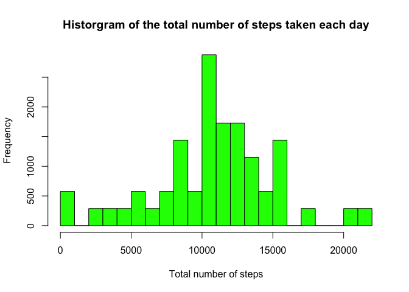
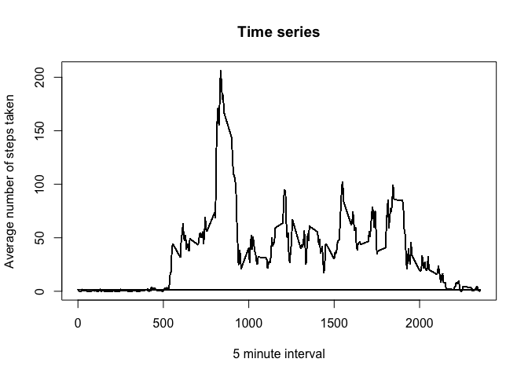
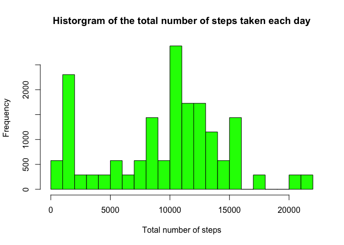
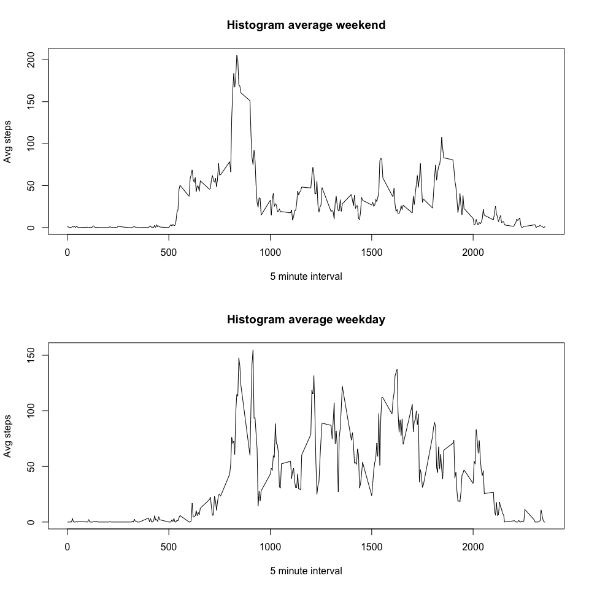

# Reproducible Research: Peer Assessment 1


## Loading and preprocessing the data

### 1. Load the data

```r
activity <- read.csv("activity.csv", header = TRUE)
```

### 2. Process the data into a format suitable for your analysis

```r
# activity <- activity[!is.na(activity$steps), ]
```


```r
library(data.table)
DT <- data.table(activity)
```


## What is mean total number of steps taken per day?

### 1. Calculate the total number of steps taken per day

```r
DT[ , total := sum(steps), by = date]
```

```
##        steps       date interval total
##     1:    NA 2012-10-01        0    NA
##     2:    NA 2012-10-01        5    NA
##     3:    NA 2012-10-01       10    NA
##     4:    NA 2012-10-01       15    NA
##     5:    NA 2012-10-01       20    NA
##    ---                                
## 17564:    NA 2012-11-30     2335    NA
## 17565:    NA 2012-11-30     2340    NA
## 17566:    NA 2012-11-30     2345    NA
## 17567:    NA 2012-11-30     2350    NA
## 17568:    NA 2012-11-30     2355    NA
```

### 2. Difference between histogram and barplot and make a histogram of the total number of steps taken each day

* The bars in histograms are adjacent, that is, there's no space between them. 
* With bar charts, each column represents a group defined by a categorical variable, that is, the variables can fit into categories.
* With histograms, each column represents a group defined by a quantitative continous variable. In theory, the variables can take on any value in a certain range. 
* A histogram follows a normal distribution. One implication of this distinction is that it is always appropriate to talk about the skewness of a histogram.
* Bar charts variables are categorical and not quantitative. As a result, it is less appropriate to comment on the skewness of a bar chart.


```r
hist(DT$total, breaks=22, col="green", xlab = "Total number of steps", 
     main="Historgram of the total number of steps taken each day")
```

 

### 3. Calculate and report the mean and median of the total number of steps


```r
summary(DT$total)["Median"]
```

```
## Median 
##  10760
```

```r
summary(DT$total)["Mean"]
```

```
##  Mean 
## 10770
```

## What is the average daily activity pattern?
### 1. Make a time series of the 5-minute interval and the average number of steps taken, averaged across all days.


```r
DT[, average := mean(steps, na.rm = TRUE), by = interval]
```

```
##        steps       date interval total   average
##     1:    NA 2012-10-01        0    NA 1.7169811
##     2:    NA 2012-10-01        5    NA 0.3396226
##     3:    NA 2012-10-01       10    NA 0.1320755
##     4:    NA 2012-10-01       15    NA 0.1509434
##     5:    NA 2012-10-01       20    NA 0.0754717
##    ---                                          
## 17564:    NA 2012-11-30     2335    NA 4.6981132
## 17565:    NA 2012-11-30     2340    NA 3.3018868
## 17566:    NA 2012-11-30     2345    NA 0.6415094
## 17567:    NA 2012-11-30     2350    NA 0.2264151
## 17568:    NA 2012-11-30     2355    NA 1.0754717
```


```r
plot(x=DT$interval, y=DT$average, type="l", xlab= "5 minute interval", 
     ylab="Average number of steps taken", main="Time series")
```

 

### 2. With 5-minute interval, on average across all the days in the dataset, contains the maximum number of steps?


```r
DT[steps == max(DT$steps, na.rm = TRUE)]$interval
```

```
## [1] 615
```

```r
DT[steps == summary(DT$steps)["Max."]]$interval
```

```
## [1] 615
```


## Imputing missing values

### 1. Calculate and report the total number of missing values in the dataset


```r
nrow(DT[is.na(DT$steps)])
```

```
## [1] 2304
```

### 2. Devise a strategy for filling in all of the missing values in the dataset. 

The strategy is to use Median for the 5-minute interval to fill in all the missing values.

### 3. Create a new dataset that is equal to the original dataset but with the missing data filled in.


```r
setkey(DT, interval)
DT[, newSteps := ifelse(is.na(steps), median(steps, na.rm=TRUE), steps), by=interval]
```

```
##        steps       date interval total  average newSteps
##     1:    NA 2012-10-01        0    NA 1.716981        0
##     2:     0 2012-10-02        0   126 1.716981        0
##     3:     0 2012-10-03        0 11352 1.716981        0
##     4:    47 2012-10-04        0 12116 1.716981       47
##     5:     0 2012-10-05        0 13294 1.716981        0
##    ---                                                  
## 17564:     0 2012-11-26     2355 11162 1.075472        0
## 17565:     0 2012-11-27     2355 13646 1.075472        0
## 17566:     0 2012-11-28     2355 10183 1.075472        0
## 17567:     0 2012-11-29     2355  7047 1.075472        0
## 17568:    NA 2012-11-30     2355    NA 1.075472        0
```

### 4. Make a histogram of the total number of steps taken each day and Calculate and report the mean and median total number of steps taken per day. Do these values differ from the estimates from the first part of the assignment? What is the impact of imputing missing data on the estimates of the total daily number of steps?


```r
DT[, newTotal := sum(newSteps), by = date]
```

```
##        steps       date interval total  average newSteps newTotal
##     1:    NA 2012-10-01        0    NA 1.716981        0     1141
##     2:     0 2012-10-02        0   126 1.716981        0      126
##     3:     0 2012-10-03        0 11352 1.716981        0    11352
##     4:    47 2012-10-04        0 12116 1.716981       47    12116
##     5:     0 2012-10-05        0 13294 1.716981        0    13294
##    ---                                                           
## 17564:     0 2012-11-26     2355 11162 1.075472        0    11162
## 17565:     0 2012-11-27     2355 13646 1.075472        0    13646
## 17566:     0 2012-11-28     2355 10183 1.075472        0    10183
## 17567:     0 2012-11-29     2355  7047 1.075472        0     7047
## 17568:    NA 2012-11-30     2355    NA 1.075472        0     1141
```

```r
hist(DT$newTotal, breaks=22, col="green", xlab = "Total number of steps", 
     main="Historgram of the total number of steps taken each day")
```

 

```r
summary(DT$newTotal)["Mean"]
```

```
## Mean 
## 9504
```

```r
summary(DT$newTotal)["Median"]
```

```
## Median 
##  10400
```

## Are there differences in activity patterns between weekdays and weekends?

### 1. Create a new factor variable in the dataset with two levels - "weekday" and "weekend"


```r
library(timeDate)

DT[, day := lapply(isWeekend(as.Date(DT$date)), 
    function(x) if(x) "weekday" else "weekend")]
```

```
##        steps       date interval total  average newSteps newTotal     day
##     1:    NA 2012-10-01        0    NA 1.716981        0     1141 weekend
##     2:     0 2012-10-02        0   126 1.716981        0      126 weekend
##     3:     0 2012-10-03        0 11352 1.716981        0    11352 weekend
##     4:    47 2012-10-04        0 12116 1.716981       47    12116 weekend
##     5:     0 2012-10-05        0 13294 1.716981        0    13294 weekend
##    ---                                                                   
## 17564:     0 2012-11-26     2355 11162 1.075472        0    11162 weekend
## 17565:     0 2012-11-27     2355 13646 1.075472        0    13646 weekend
## 17566:     0 2012-11-28     2355 10183 1.075472        0    10183 weekend
## 17567:     0 2012-11-29     2355  7047 1.075472        0     7047 weekend
## 17568:    NA 2012-11-30     2355    NA 1.075472        0     1141 weekend
```


### 2. Make a panel plot containing a time series plot of the 5-minute interval and average number of steps taken, averaged across all weekday days or weekend days.


```r
weekend <- subset(DT, day=="weekend")
DT2 <- weekend[, averageWeekend := mean(newSteps), by = interval]

weekday <- subset(DT, day=="weekday")
DT3 <- weekday[, averageWeekday := mean(newSteps), by = interval]
```


```r
par(mfrow = c(2,1))
plot(DT2$interval, DT2$averageWeekend, type="l", xlab="5 minute interval", 
     ylab="Avg steps", main="Histogram average weekend")
plot(DT3$interval, DT3$averageWeekday, type="l", xlab="5 minute interval", 
     ylab="Avg steps", main="Histogram average weekday")
```

 
